# Reef OCR System
## Project Handover Notice

**IMPORTANT**: I am officially stepping back from maintaining this project due to educational commitments and work obligations. Full ownership and maintenance responsibilities are being transferred to 42KL, who will oversee all future development and support.

**NOTE ON AZURE SERVICES**: My student Azure account has been disabled, which means I can no longer train new models for the Form Recognizer service. Any future model training will require setting up a new Azure account.

---

## System Overview

The Reef OCR System is a specialized application designed to process reef survey forms using Azure's AI Form Recognizer service. It extracts structured data from images of standardized reef survey forms and converts them into structured Excel reports for analysis.

### Key Features

- **Advanced Image Preprocessing**: Automatically enhances low-quality images for better OCR results
- **Multi-format Support**: Processes both old and new versions of reef survey forms
- **Data Validation**: Validates substrate codes and identifies potential errors
- **Interactive Reports**: Generates formatted Excel reports with data highlighting
- **Multiple Input Methods**: Accepts both direct file uploads and image URLs
- **Detailed Error Reporting**: Provides specific feedback for processing issues

## System Architecture

The system follows a modular architecture as shown in the flowchart below:

```mermaid
flowchart LR
    %% Main Request Flow
    Client([Web Browser/API Client]) --> WebServer[Express Web Server]
    WebServer --> Routes{API Routes}
    
    %% Request Paths
    Routes -->|GET /| UI[Render UI]
    Routes -->|POST /api/upload| Upload[Upload Handler]
    Routes -->|POST /api/process-url| URLProc[URL Handler]
    Routes -->|GET /api/health| Health[Health Check]
    
    %% File Processing Path
    Upload --> Multer[Multer Middleware]
    Multer --> ValidateFile{Validate File}
    ValidateFile -->|Invalid| ErrorResp1[Return Error]
    ValidateFile -->|Valid| SaveTemp[Save to Temp]
    
    %% URL Processing Path
    URLProc --> ValidateURL{Validate URL}
    ValidateURL -->|Invalid| ErrorResp2[Return Error]
    ValidateURL -->|Valid| DownloadImg[Download Image]
    DownloadImg --> SaveTemp
    
    %% Image Processing
    SaveTemp --> OCRService[OCR Service]
    OCRService --> ImgPreproc[Image Preprocessing]
    
    subgraph "Image Enhancement Pipeline"
        ImgPreproc --> AnalyzeImg[Analyze Image Quality]
        AnalyzeImg --> ImgStrategy{Select Strategy}
        
        ImgStrategy -->|Low Resolution| UpscaleImg[Upscale + Enhance]
        ImgStrategy -->|Dark Image| BrightenImg[Brightness + Contrast]
        ImgStrategy -->|Normal| StandardProc[Standard Processing]
        ImgStrategy -->|Very Poor| MultiStrategy[Try Multiple Strategies]
        
        UpscaleImg --> Grayscale[Convert to Grayscale]
        BrightenImg --> Grayscale
        StandardProc --> Grayscale
        MultiStrategy --> SelectBest[Select Best Result]
        SelectBest --> Grayscale
        
        Grayscale --> Normalize[Normalize]
        Normalize --> Sharpen[Sharpen]
        Sharpen --> Threshold[Threshold]
        Threshold --> OutputImg[Preprocessed Image]
    end
    
    %% Azure Processing
    OutputImg --> AzureService[Azure Service]
    
    subgraph "Azure Form Recognizer"
        AzureService --> CreateClient[Create Azure Client]
        CreateClient --> UploadDoc[Upload Document]
        UploadDoc --> StartAnalysis[Begin Analysis]
        StartAnalysis --> PollResults[Poll for Results]
        PollResults --> CheckSuccess{Success?}
        CheckSuccess -->|No| RetryOrFail{Retry?}
        RetryOrFail -->|Yes| StartAnalysis
        RetryOrFail -->|No| FailAzure[Throw Azure Error]
        CheckSuccess -->|Yes| ProcessResults[Process Results]
    end
    
    %% Data Extraction
    ProcessResults --> DataExtractionService[Data Extraction]
    
    subgraph "Data Processing"
        DataExtractionService --> ExtractFields[Extract Form Fields]
        ExtractFields --> DetectVersion{Detect Form Version}
        
        DetectVersion -->|Old Format| ProcessSegments[Process Segment Data]
        DetectVersion -->|New Format| ProcessSpecies[Process Species Data]
        
        ProcessSegments --> ValidateCodes[Validate Substrate Codes]
        ValidateCodes --> FillBlanks[Fill Blank Fields]
        FillBlanks --> CalculateStats[Calculate Statistics]
        
        ProcessSpecies --> ExtractTables[Extract Tables]
        ExtractTables --> ProcessTables[Process Table Data]
    end
    
    %% Report Generation
    ProcessTables --> ReportService[Report Service]
    CalculateStats --> ReportService
    
    subgraph "Report Generation"
        ReportService --> CreateWorkbook[Create Excel Workbook]
        CreateWorkbook --> AddFields[Add Fields Section]
        
        AddFields --> CheckVersion{Form Version}
        CheckVersion -->|Old Format| AddSegments[Add Segment Tables]
        CheckVersion -->|New Format| AddSpecies[Add Species Tables]
        
        AddSegments --> AddLegend[Add Substrate Legend]
        AddLegend --> AddStats[Add Statistics]
        
        AddSpecies --> FormatWorksheet[Format Worksheet]
        AddStats --> FormatWorksheet
        
        FormatWorksheet --> SaveExcel[Save Excel File]
        SaveExcel --> JsonRequested{JSON Requested?}
        JsonRequested -->|Yes| SaveJSON[Save JSON Data]
        JsonRequested -->|No| SkipJSON[Skip JSON]
        
        SaveJSON --> GenerateCSV[Generate CSV Reports]
        SkipJSON --> GenerateCSV
    end
    
    %% Response Handling
    GenerateCSV --> PrepareResponse[Prepare Response]
    PrepareResponse --> ReturnType{Return Type}
    ReturnType -->|Excel Only| SendExcel[Send Excel File]
    ReturnType -->|With JSON| CreateZIP[Create ZIP Archive]
    CreateZIP --> SendZIP[Send ZIP File]
    
    %% Error Handling Paths
    SendExcel --> Cleanup[Cleanup Temp Files]
    SendZIP --> Cleanup
    Cleanup --> End([End Request])
    
    ErrorResp1 --> End
    ErrorResp2 --> End
    FailAzure --> ErrorHandling[Error Handling Middleware]
    ErrorHandling --> End
    
    %% Error Handling Throughout System
    OCRService -->|Error| ErrorHandling
    ImgPreproc -->|Error| ErrorHandling
    AzureService -->|Error| ErrorHandling
    DataExtractionService -->|Error| ErrorHandling
    ReportService -->|Error| ErrorHandling
    
    %% Style Definitions
    classDef process fill:#f9f9f9,stroke:#333,stroke-width:1px;
    classDef decision fill:#e1f5fe,stroke:#01579b,stroke-width:1px;
    classDef data fill:#e8f5e9,stroke:#2e7d32,stroke-width:1px;
    classDef error fill:#ffebee,stroke:#c62828,stroke-width:1px;
    classDef endpoint fill:#ede7f6,stroke:#4527a0,stroke-width:1px;
    
    class Client,WebServer,End endpoint;
    class ValidateFile,ValidateURL,ImgStrategy,CheckSuccess,RetryOrFail,DetectVersion,CheckVersion,JsonRequested,ReturnType decision;
    class SaveTemp,OutputImg,ProcessResults data;
    class ErrorResp1,ErrorResp2,FailAzure,ErrorHandling error;
    class Upload,URLProc,OCRService,ImgPreproc,AzureService,DataExtractionService,ReportService process;
```



## Setup Instructions

### Prerequisites

- Node.js (v14 or higher)
- npm (v6 or higher)
- An Azure account with Form Recognizer service
- A trained custom model in Form Recognizer for reef survey forms

### Installation

1. Clone the repository:
   ```bash
   git clone https://github.com/Raspberrynani/reef-ocr.git
   cd reef-ocr
   ```

2. Install dependencies:
   ```bash
   npm install
   ```

3. Create a `.env` file in the project root with the following variables:
   ```
   PORT=8080
   FORM_RECOGNIZER_ENDPOINT=your-azure-endpoint
   FORM_RECOGNIZER_API_KEY=your-azure-key
   FORM_RECOGNIZER_CUSTOM_MODEL_ID=your-model-id
   NODE_ENV=production
   ```

4. Create the required directories if they don't exist:
   ```bash
   mkdir uploads output compressedLogs
   ```

5. Start the application:
   ```bash
   npm start
   ```

## API Endpoints

### 1. Web Interface

- **URL**: `/`
- **Method**: `GET`
- **Description**: Provides a web interface for uploading images or entering URLs

### 2. File Upload

- **URL**: `/api/upload`
- **Method**: `POST`
- **Content-Type**: `multipart/form-data`
- **Body Parameters**:
  - `file`: Image file (JPG, PNG, TIFF, etc.)
- **Optional Headers**:
  - `x-return-json`: Set to `true` to receive JSON data alongside Excel
- **Response**: Excel file or ZIP archive with Excel + JSON + validation reports
- **Example**:
  ```bash
  curl -X POST http://localhost:8080/api/upload \
    -H "x-return-json: true" \
    -F "file=@/path/to/image.jpg"
  ```

### 3. Process URL

- **URL**: `/api/process-url`
- **Method**: `POST`
- **Content-Type**: `application/json`
- **Body**:
  ```json
  {
    "url": "https://example.com/reef-survey-image.jpg"
  }
  ```
- **Optional Headers**:
  - `x-return-json`: Set to `true` to receive JSON data alongside Excel
- **Response**: Excel file or ZIP archive with Excel + JSON + validation reports
- **Example**:
  ```bash
  curl -X POST http://localhost:8080/api/process-url \
    -H "Content-Type: application/json" \
    -H "x-return-json: true" \
    -d '{"url": "https://example.com/reef-survey-image.jpg"}'
  ```

### 4. Health Check

- **URL**: `/api/health`
- **Method**: `GET`
- **Description**: Check if the system is operational
- **Response**: JSON status information

## Directory Structure

```
reef-ocr/
├── compressedLogs/      # Logs of system operation
├── LICENSE              # License file
├── old_source/          # Original source code (for reference)
│   ├── refined.js
│   └── refine.js
├── output/              # Output files (Excel, JSON, CSV)
├── package.json         # Project dependencies
├── package-lock.json    # Locked dependencies
├── README.md            # Project documentation
├── ReefOCR/             # Main application code
│   ├── app.js           # Entry point
│   ├── config/          # Configuration files
│   │   └── index.js     # Main configuration
│   ├── controllers/     # Request handlers
│   │   ├── imageController.js  # Image processing controller
│   │   └── uiController.js     # Web interface controller
│   ├── middleware/      # Express middleware
│   │   ├── errorHandler.js     # Error handling
│   │   └── upload.js           # File upload handling
│   ├── routes/          # API routes
│   │   ├── api.js       # API endpoints
│   │   └── ui.js        # UI routes
│   ├── services/        # Core application services
│   │   ├── azureService.js     # Azure integration
│   │   ├── imageService.js     # Image preprocessing
│   │   ├── ocrService.js       # OCR orchestration
│   │   └── reportService.js    # Report generation
│   └── utils/           # Utility functions
│       ├── dataUtils.js     # Data processing
│       └── fileUtils.js     # File operations
└── uploads/             # Temporary file storage
```

## Maintenance Guide

### Common Tasks

#### Adding Support for New Form Types

1. Update the `dataUtils.js` file to include new field detection functions
2. Modify the `reportService.js` to handle new table formats
3. Test with representative images before deployment

#### Enhancing Image Preprocessing

The `imageService.js` file contains all image preprocessing logic. To improve handling of difficult images:

1. Identify the specific image quality issue (low light, blur, etc.)
2. Create a new preprocessing strategy in `imageService.js`
3. Update the strategy selection logic

#### Updating the Azure Model

If a new Azure Form Recognizer model is created:

1. Update the `.env` file with the new model ID
2. Test thoroughly with representative images
3. Update any field extraction logic if the model outputs different field names

### Troubleshooting

#### Azure Connection Issues

1. Check that the Azure credentials in `.env` are still valid
2. Verify the service is active in the Azure portal
3. Test with Azure's REST API directly to isolate the issue

#### Image Processing Failures

1. Look for errors in the logs
2. Try the problematic image with different preprocessing settings
3. Check if the image size or format is causing issues

#### Server Performance Issues

1. Monitor memory usage during processing
2. Check disk space for temporary and output files
3. Consider implementing rate limiting for high traffic scenarios

## Azure Form Recognizer Details

The system uses a custom trained model in Azure Form Recognizer to extract data from reef survey forms. The model was trained to recognize:

1. **Form Fields**: Location, Date, Island/Country, Team Leader, etc.
2. **Table Data**: Structured data with substrate codes, depths, and other measurements

### Model Limitations

- The current model has been trained on a specific set of form layouts
- Forms with significant variations may not be processed correctly
- Model accuracy varies based on image quality

## Future Development Recommendations

1. **Multiple Model Support**: Implement support for multiple Form Recognizer models
2. **Batch Processing**: Add capability to process multiple images in one request
3. **Result Database**: Store processing results in a database for historical analysis
4. **User Authentication**: Add user accounts for secure access
5. **Advanced Analytics**: Integrate with data analysis tools

## Technical Details for Developers

### Image Preprocessing Pipeline

The system uses the Sharp library for image preprocessing with the following steps:

1. **Image Analysis**: Analyze image quality and characteristics
2. **Strategy Selection**: Choose appropriate preprocessing based on image properties
3. **Enhancement**: Apply filters, adjustments, and transformations
4. **Validation**: Check preprocessed image quality before OCR

### Azure Integration

Communication with Azure Form Recognizer happens through:

1. **Authentication**: Azure Key Credential for secure API access
2. **Document Analysis**: Begin analysis with customized parameters
3. **Polling**: Poll for results with appropriate timeout handling
4. **Result Processing**: Extract and validate results from Azure response

### Excel Report Generation

Excel reports are generated using ExcelJS with:

1. **Worksheets**: Create formatted worksheets for data
2. **Styling**: Apply conditional formatting based on data validity
3. **Validation**: Highlight potential issues in the data
4. **Statistics**: Include summary statistics for data quality

---

## Contact Information

For questions or issues related to this project, please contact 42KL. As mentioned at the top of this document, I am no longer maintaining this project and have transferred all responsibilities to 42KL.

---

## License

This project is licensed under the GPL 3.0 License - see the LICENSE file for details.
